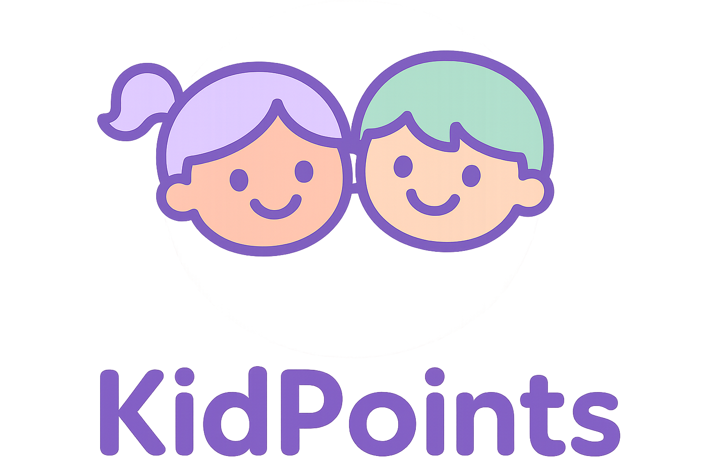

# KidPoints



KidPoints est une application web ludique pour aider les parents à gérer les tâches et les récompenses de leurs enfants.  
Chaque enfant peut accomplir des tâches, gagner des points, monter de niveau, et obtenir des récompenses.  

---

## Fonctionnalités principales

- Gestion multi-enfants (ajout, modification, suppression)
- Création, suivi et validation des tâches (TODO, en cours, terminées)
- Attribution automatique de points pour chaque tâche complétée
- Affichage clair des progrès et niveaux des enfants
- Tableau de bord parent pour suivre l'activité des enfants
- Interface responsive adaptée au desktop et mobile
- Authentification sécurisée via Supabase
- Internationalisation (Français / Anglais)
- Design moderne et ludique avec Tailwind CSS

---

## Tech stack

- [Nuxt 3](https://nuxt.com/) - Framework Vue.js côté serveur et client
- [Vue 3](https://vuejs.org/) - Framework frontend moderne
- [Supabase](https://supabase.com/) - Backend as a Service (auth, base de données, realtime)
- [TypeScript](https://www.typescriptlang.org/) - Typage statique
- [Tailwind CSS](https://tailwindcss.com/) - Utilitaire CSS pour un style rapide et responsive
- [Zod](https://github.com/colinhacks/zod) - Validation des données
- [@tanstack/vue-query](https://tanstack.com/query/latest/docs/vue/overview) - Gestion des requêtes et du cache

---

## Installation & setup

### Prérequis

- Node.js 18+
- pnpm ou npm/yarn
- Compte Supabase (pour la base et l'auth)

### Cloner le projet

```bash
git clone https://github.com/Family-Quest/KidsPoints.git
cd KidsPoints
